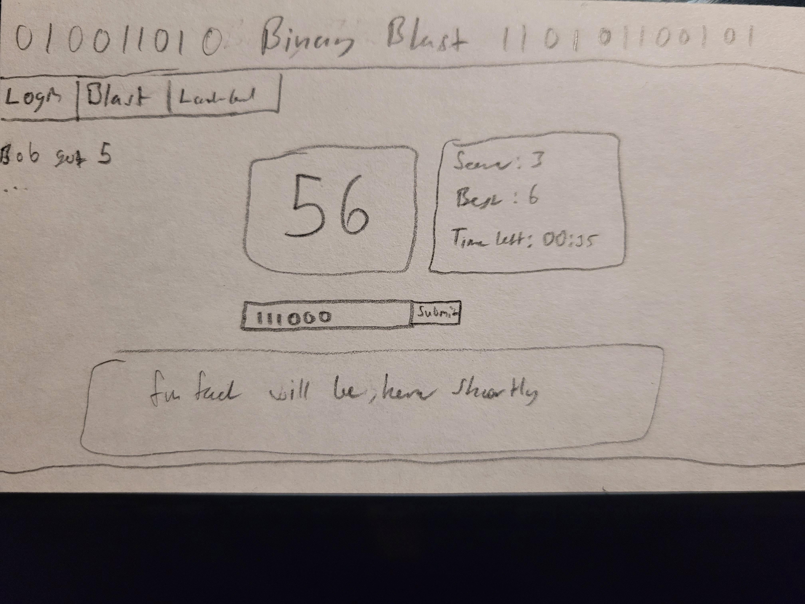

# startup
Startup application for BYU cs260 2024

## Startup Specification

### Elevator Pitch

While the base 10 system is the foundation of all math taught to kids, learning the base 2 system can be difficult as people start to learn programming. This simple game system will allow the common user to learn the basics of the binary number system in a easy, fun way, being shown a random number and being prompted to give the binary representation. Given a minute to do so, every correct answer will increase their score and add 10 seconds to their time, allowing competition with other players, top scores being displayed on a leaderboard, and users pinged with completed times as they come in. A random fun fact is displayed upon completion of game.

### Design

### Key Features

* Secure Login
* Start a game
* Have best score persistent across logins
* Leaderboard of top 10 scores maintained and updated
* Display of random Fun Fact upon game completion
* Other active user score displayed as they complete a game

### Technologies

The following technologies will be used in these ways:

- HTML - Correct HTML structure, allowing for 3 pages (login, game, leaderboard w/ hints); hyperlinks between each
- CSS - Styling that allows for different sizes. Light matrix aesthetic with simple yet nice colors and contrast
- React - contains Javascript meshed with the CSS and HTML. Allows for login, gameplay, leaderboard updates, and 
- Service - Backend service provided for retrieving and posting leaderboard data and a random fun fact provided by an API.
- DB/ Login - Stores Users and game times in database. Register and login users, credentials being stored and game unable to be played without authentication.
- Websocket - actively updates leaderboard, gives player a note of other active players achieved score upon their completion

### HTML Deliverable

In this deliverable, i created the html structure for 3 pages of my application

- HTML Pages - created html for 3 pages representing a login, game, and score/info page
- Links - evtery page has links to every other page
- Text - a scoreboard that will be updated, and a series of paragraphs explaining the game and binary
- images - used 2 images to supplement binary description
- DB/Login - input fields for login. Scores will be updated from database populated with scores generated from giving inputs on the game page tied to user
- Websocket - other user scores displayed as the scores are generated from finished games. Leaderboard will update in real time

### CSS Deliverable

In this deliverable, I created the css styling for the application

- Header, footer, and main content body
- Navigation elements - made into horizontal list, bootstrapped for style, and highlights on hover
- Responsive to window resizing - All pages look great except the corner box on game.html will overlap before reaching a size justifying its hiding
- Application elements - clear contrast, if a bit bland
- Application text content - consistent font and style
- Application images - centered, padded, and made responsive

### React Deliverable

In this deliverable, I implemeneted the React based js functionality for the site.

- Bundled and transpiled - done!
- Components - Login, Game, Scores
    - Login is based on Simon and works, except for some styling errors
    - database - best score is persistnet and stored locally. global high scores from all simulated players are not
    - Websocket is simulated, displaying the scores of users 4 at a time
    - The Game runs, but is currently exceptionally difficult. A learning curve needs to be implemented
- Router - Routing between all elements
- Hooks - states and effects in active use throughout functionality.

### Service Deliverable

In this deliverable, front and back end service implementation was created.

- Node.js/express HTTP service - completed
- Static middleware for frontend - implemented
- Calls to third party endpoints - call goes out, works on local testing, not on deployment
- Backend service endpoints - placeholders for score and user storage created
- Frontend calls service endpoints - Fetch implemented, scores are successfully saved
