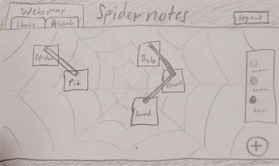

# startup
## The Pitch
**Spidernotes** is the solution to the conspiracy theorist needing to transition to the digital age. The application gives you the ability to create *mindmaps*, complete with digital strings to link events, persons and places for whatever web you need to create to organize your ideas. This allows the chronically online author or worldbuilder to quickly create and access relationship maps and link ideas and concepts in a visual way. The application ties each map to your own user account, but you can also see live global statistics for how many threads have been laid, and what percentage of them has been your contribution.

## Key Features
- Secure User account creation and authentication
- A Map page with an area to "pin notes" on and a create note button. Name it and give it a description, then drag and place on the map grid. (*only the name will be displayed*). Hover on a note to see the description.
- Right clicking two notes will link them together with a thread (*you can change the thread color*). Name the thread to create a legend off to the side.
- A Statistics page that records how many threads have been made, and what percentage is your own contribution.
- An About page displaying information about the function, purpose, and history of the application
## Technologies
### HTML
A basic header and footer across the top and bottom of each page, initially showing only a box for user sign in, but that gives way to the map page, which is initially blank, but will display your most recent map, with tabs in the header for the statistics and about page, as well as a logout button. The Statistics page will display global statistics for number of maps made, threads made, and your own percentage of the total.
### CSS
A faded spiderweb is the principle background, with a pleasant blue and grey accented header, border, and button wraps. The notes on the map page will be displayed as sticky notes, with colored threads linking them all. Each page will be size adjustable to whatever screen they are displayed on.
### JavaScript
Provides Login, Note creation and viewing, thread creation and editing, and tab selection, statisics keeping and display, and backend endpoint calls.
### Service
Backend service with endpoints for:
- login
- retrieving your map notes and threads
- adding notes and threads
- updating statistics
### DB/Login
store map upon logout in array of arrays, with threads stored as pointers to different "cells", recalling map upon login credential verfication. Stores and updates thread statistics.
### WebSocket
As each new thread is made, a global statistic is updated across all users and displayed to them.
### React 
Application will be ported to React web framework use.
